 <h1> Heyy There! </h1> 

<h3>Let's Connect</h3>

 
 

-  I am @JohnX4321 a.k.a Samarth. 

-  I have worked on Android Phones, Android VR Headsets, Wear OS, Android PoS, Android Dashboards on Electric Vehicles including Play Store Apps and System Apps as well

-  I’m interested in Coding, Drawing, Travelling.
  
-  Working on Innovative Projects
  
-  I’m looking to collaborate on anything

<h2> Technical Skills 💻 </h2>

 
 
 

 

<!--
<h2>GitHub Stats 📈</h2>

  -->

<h2>Stats</h2>

Profile Picture - My profile picture is an Airbus A350 because it revolutionized air travel, with a unique design, composite materials and efficient.

<!---
JohnX4321/JohnX4321 is a ✨ special ✨ repository because its `README.md` (this file) appears on your GitHub profile.
You can click the Preview link to take a look at your changes.
--->
