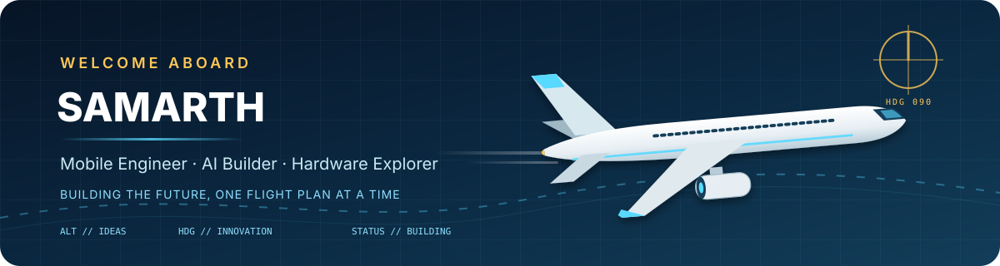

  

## ✈️ Mobile Engineer · AI Builder · Hardware Explorer

Building useful software across **Android, AI, cloud, and connected devices**.

---

## 🧭 Flight Plan

- 📱 Designing mobile experiences with Android, Kotlin, and Flutter
- 🤖 Building practical AI tools and intelligent applications
- ☁️ Exploring serverless architectures and cloud-native systems
- 🔧 Working with hardware, connected devices, and developer tools
- 🚀 Turning ambitious ideas into useful products

> **Mission:** Build technology that feels as thoughtful, reliable, and efficient as a well-engineered aircraft.

## 🛫 Featured Projects

| Project | Mission | Stack |
|---|---|---|
| [**Beam**](https://github.com/samarthsubramanya/Beam) | Kotlin application project | Kotlin |
| [**ADBDesk**](https://github.com/samarthsubramanya/ADBDesk) | Desktop tooling for Android devices | Kotlin |
| [**SnipURL**](https://github.com/samarthsubramanya/SnipURL) | Lightweight serverless URL shortener | Python · AWS Lambda |
| [**Portfolio**](https://samarthagasthya.vercel.app/) | Personal portfolio and project showcase | TypeScript |

## 🧰 Aircraft Systems — Technical Skills

### Mobile & Frontend

### Backend, Cloud & Systems

### AI & Emerging Tech

## 📡 Current Transmission

> Currently building innovative projects and looking to collaborate with people who enjoy solving difficult problems.

If you’re working on **mobile apps, AI products, developer tools, or hardware-integrated experiences**, let’s connect.

## 🌍 Beyond the Runway

When I’m not building software, you’ll probably find me:

- ✏️ Drawing
- 🌍 Travelling
- ✈️ Reading about aviation and aircraft design
- 🧪 Experimenting with new technologies

### Thanks for stopping by ✨

  

My profile picture is an Airbus A350, inspired by its distinctive design, composite materials, and efficient engineering.

<!---
JohnX4321/JohnX4321 is a ✨ special ✨ repository because its `README.md` (this file) appears on your GitHub profile.
You can click the Preview link to take a look at your changes.
-->
